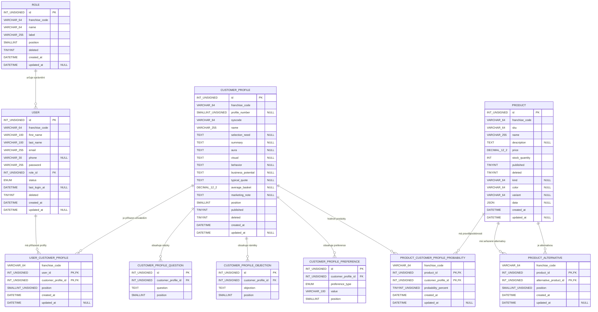

# Customer Profile Module

All HTTP routes require `X-Internal-Key` in the common API middleware, including
routes described below as public (no user login). User role/ownership checks
remain additional requirements.

Purpose: tenant-scoped customer-profile definitions and their ordered questions,
objections, and preferences.

Read first:

- `CustomerProfileApi.php`
- `CustomerProfileService.php`
- `CustomerProfileRepository.php`

Routes:

- `GET /customer-profiles`
- `GET /customer-profiles/:id`
- `POST /customer-profiles`
- `PATCH /customer-profiles/:id`
- `PUT /customer-profiles/:id`
- `DELETE /customer-profiles/:id`

Notes:

- `GET /customer-profiles/:id` is public for a published profile; an unpublished profile returns 404 without an admin Bearer token.
- The list and all create, update, and delete routes require the admin role.
- `customer_profile` owns the profile definition; it is not an enumeration and is not embedded in `user`.
- `customer_profile_question`, `customer_profile_objection`, and `customer_profile_preference` contain ordered child rows and are deleted by cascade with their profile.
- Supplying `questions`, `objections`, or `preferences` synchronizes that complete child collection. Omitting a collection leaves it unchanged.
- Users connect through `user_customer_profile`; products connect through `product_customer_profile_probability`.
- All profile, user, product, and relation lookups remain scoped to the current `franchise_code`.

---

## Datový model zákaznických profilů

Tento dokument popisuje aktuální databázový model profilů zákazníků společný
pro tenanty Zoo a FAnn. Zdroj pravdy pro nové databáze je
[`migrations/schema.sql`](../../../migrations/schema.sql); existující databáze převádí
[`migrations/20260912_customer_profiles.sql`](../../../migrations/20260912_customer_profiles.sql)
a následné přejmenování vazeb provádí
[`migrations/20260912_rename_customer_profile_relations.sql`](../../../migrations/20260912_rename_customer_profile_relations.sql).
Sloupec pořadí vazby sjednocuje
[`migrations/20260913_user_customer_profile_position.sql`](../../../migrations/20260913_user_customer_profile_position.sql).

### Diagram tabulek a vazeb



`USER_CUSTOMER_PROFILE` vytváří vztah M:N mezi uživatelem a profilem.
`PRODUCT_CUSTOMER_PROFILE_PROBABILITY` vytváří vztah M:N mezi produktem a
profilem a k vazbě přidává jedinou procentuální pravděpodobnost nákupu.
Produkty od 30 % aplikace zobrazují jako pravděpodobné a řadí je sestupně.

`PRODUCT_ALTERNATIVE` je směrová M:N vazba produktu na jiné existující produkty.
`position` určuje pořadí alternativ; shodu tenantů kontroluje API před zápisem.

### Tabulky a sloupce

#### `customer_profile`

Definice jednoho typu zákazníka. Profil není uložen v `user` ani v číselníku.

| Sloupec | Typ | NULL | Význam |
|---|---|---:|---|
| `id` | `INT UNSIGNED` | ne | Primární klíč. |
| `franchise_code` | `VARCHAR(64)` | ne | Tenant, například `zoo` nebo `fun`. |
| `profile_number` | `SMALLINT UNSIGNED` | ano | Uživatelsky zobrazované pořadové číslo profilu. |
| `syscode` | `VARCHAR(64)` | ne | Stabilní strojový identifikátor, unikátní v tenantovi. |
| `name` | `VARCHAR(255)` | ne | Název profilu. |
| `selection_need` | `TEXT` | ano | Jak zákazník vybírá a co potřebuje. |
| `summary` | `TEXT` | ano | Krátké shrnutí profilu. |
| `aura` | `TEXT` | ano | Celkové vyznění profilu. |
| `visual` | `TEXT` | ano | Typické vizuální znaky. |
| `behavior` | `TEXT` | ano | Typické chování. |
| `business_potential` | `TEXT` | ano | Obchodní potenciál. |
| `typical_quote` | `TEXT` | ano | Typická věta zákazníka. |
| `average_basket` | `DECIMAL(12,2)` | ano | Orientační průměrná hodnota nákupu. |
| `marketing_note` | `TEXT` | ano | Poznámka pro marketing nebo obsluhu. |
| `position` | `SMALLINT` | ne | Pořadí ve výpisu, výchozí `0`. |
| `published` | `TINYINT(1)` | ne | Viditelnost profilu, výchozí `1`. |
| `deleted` | `TINYINT(1)` | ne | Soft-delete příznak, výchozí `0`. |
| `created_at` | `DATETIME` | ne | Čas vytvoření. |
| `updated_at` | `DATETIME` | ano | Čas poslední změny. |

Unikátní jsou dvojice (`franchise_code`, `syscode`) a
(`franchise_code`, `profile_number`).

#### `customer_profile_question`

Otázky, které může prodavač použít při rozpoznání nebo obsluze profilu.

| Sloupec | Typ | NULL | Význam |
|---|---|---:|---|
| `id` | `INT UNSIGNED` | ne | Primární klíč. |
| `customer_profile_id` | `INT UNSIGNED` | ne | FK na `customer_profile.id`. |
| `question` | `TEXT` | ne | Text otázky. |
| `position` | `SMALLINT` | ne | Pořadí otázky, výchozí `0`. |

Dvojice (`customer_profile_id`, `position`) je unikátní. Smazání profilu smaže
otázky pomocí `ON DELETE CASCADE`.

#### `customer_profile_objection`

Typické námitky zákazníka daného profilu.

| Sloupec | Typ | NULL | Význam |
|---|---|---:|---|
| `id` | `INT UNSIGNED` | ne | Primární klíč. |
| `customer_profile_id` | `INT UNSIGNED` | ne | FK na `customer_profile.id`. |
| `objection` | `TEXT` | ne | Text námitky. |
| `position` | `SMALLINT` | ne | Pořadí námitky, výchozí `0`. |

Dvojice (`customer_profile_id`, `position`) je unikátní. Smazání profilu smaže
námitky pomocí `ON DELETE CASCADE`.

#### `customer_profile_preference`

Strukturované preference používané hlavně v Zoo pro druh zvířete nebo druh
produktu.

| Sloupec | Typ | NULL | Význam |
|---|---|---:|---|
| `id` | `INT UNSIGNED` | ne | Primární klíč. |
| `customer_profile_id` | `INT UNSIGNED` | ne | FK na `customer_profile.id`. |
| `preference_type` | `ENUM('animal','product_kind')` | ne | Typ preference. |
| `value` | `VARCHAR(100)` | ne | Hodnota preference. |
| `position` | `SMALLINT` | ne | Pořadí preference, výchozí `0`. |

Kombinace (`customer_profile_id`, `preference_type`, `value`) je unikátní.
Smazání profilu smaže preference pomocí `ON DELETE CASCADE`.

#### `user_customer_profile`

Přiřazuje uživateli libovolný počet zákaznických profilů. Sloupec `position`
určuje jejich pořadí: `1` je první, vyšší čísla jsou další profily.

| Sloupec | Typ | NULL | Význam |
|---|---|---:|---|
| `franchise_code` | `VARCHAR(64)` | ne | Tenant vazby. |
| `user_id` | `INT UNSIGNED` | ne | FK na `user.id`, část složeného PK. |
| `customer_profile_id` | `INT UNSIGNED` | ne | FK na `customer_profile.id`, část složeného PK. |
| `position` | `SMALLINT UNSIGNED` | ne | Pořadí profilu u uživatele, výchozí `1`. |
| `created_at` | `DATETIME` | ne | Čas vytvoření vazby. |
| `updated_at` | `DATETIME` | ano | Čas poslední změny vazby. |

Primární klíč je (`user_id`, `customer_profile_id`). Dvojice (`user_id`,
`position`) je také unikátní, takže jeden uživatel nemůže mít dvě vazby se
stejným pořadím. Smazání uživatele nebo profilu smaže vazbu pomocí
`ON DELETE CASCADE`.

#### `product_customer_profile_probability`

Popisuje vhodnost produktu pro konkrétní profil zákazníka.

| Sloupec | Typ | NULL | Význam |
|---|---|---:|---|
| `franchise_code` | `VARCHAR(64)` | ne | Tenant vazby. |
| `product_id` | `INT UNSIGNED` | ne | FK na `product.id`, část složeného PK. |
| `customer_profile_id` | `INT UNSIGNED` | ne | FK na `customer_profile.id`, část složeného PK. |
| `probability_percent` | `TINYINT UNSIGNED` | ne | Pravděpodobnost nákupu od `0` do `100`, výchozí `0`. Hodnota alespoň `30` označuje pravděpodobný produkt. |
| `created_at` | `DATETIME` | ne | Čas vytvoření vazby. |
| `updated_at` | `DATETIME` | ano | Čas poslední změny vazby. |

Primární klíč je (`product_id`, `customer_profile_id`). Databázový CHECK hlídá
rozsah `probability_percent` 0–100. Smazání produktu nebo profilu smaže vazbu
pomocí `ON DELETE CASCADE`.

#### `product_alternative`

Ukládá seřazené alternativní produkty jako směrovou vazbu produktu na produkt.

| Sloupec | Typ | NULL | Význam |
|---|---|---:|---|
| `franchise_code` | `VARCHAR(64)` | ne | Tenant vazby. |
| `product_id` | `INT UNSIGNED` | ne | Zdrojový produkt, část složeného PK. |
| `alternative_product_id` | `INT UNSIGNED` | ne | Alternativní produkt, část složeného PK. |
| `position` | `SMALLINT UNSIGNED` | ne | Pořadí alternativy u produktu, výchozí `1`. |
| `created_at` | `DATETIME` | ne | Čas vytvoření vazby. |
| `updated_at` | `DATETIME` | ano | Čas poslední změny vazby. |

Primární klíč je (`product_id`, `alternative_product_id`) a dvojice
(`product_id`, `position`) je unikátní. Oba produktové cizí klíče používají
`ON DELETE CASCADE`; databázový CHECK zakazuje, aby byl produkt vlastní
alternativou.

#### Související tabulky `role`, `user` a `product`

`user` nemá žádný sloupec s profilem zákazníka. Vazba existuje výhradně přes
`user_customer_profile`. `product.data` může obsahovat jiné projektové atributy
nebo historická seed data, ale zdrojem aktuálních profilových pravděpodobností je
`product_customer_profile_probability`.

| Tabulka | Sloupce |
|---|---|
| `role` | `id`, `franchise_code`, `name`, `label`, `position`, `deleted`, `created_at`, `updated_at` |
| `user` | `id`, `franchise_code`, `first_name`, `last_name`, `email`, `phone`, `password`, `role_id`, `status`, `last_login_at`, `deleted`, `created_at`, `updated_at` |
| `product` | `id`, `franchise_code`, `sku`, `name`, `description`, `price`, `stock_quantity`, `published`, `deleted`, `kind`, `color`, `variant`, `data`, `created_at`, `updated_at` |

`user.role_id` odkazuje na `role.id` s pravidlem `ON DELETE RESTRICT`.
Databázové cizí klíče vazeb používají číselná ID; shodu `franchise_code` navíc
hlídají tenant-scoped repository dotazy před každým zápisem a čtením.

### API reprezentace

Názvy databázových tabulek nejsou součástí veřejného API:

- uživatel dostává pole `profiles`; každý profil obsahuje také `position`,
- produkt dostává pole `profile_probabilities` s položkami
  `customer_profile_id`, `probability_percent`, `syscode` a `name`,
- definice profilů se spravují přes `/customer-profiles`,
- `franchise_code` určuje tenant a klient jej neposílá jako editovatelné pole.

Příklad přiřazení profilů uživateli:

```json
{
  "profiles": [
    { "customer_profile_id": 3, "position": 1 },
    { "customer_profile_id": 2, "position": 2 }
  ]
}
```

Příklad pravděpodobností produktu:

```json
{
  "profile_probabilities": [
    {
      "customer_profile_id": 3,
      "probability_percent": 85
    }
  ]
}
```
