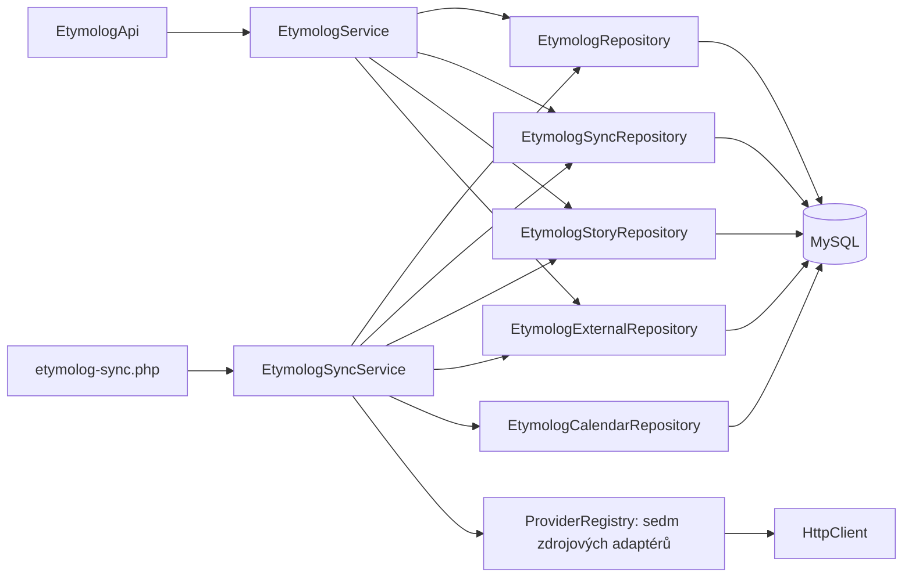

# Etymolog

Tenantová redakční databáze křestních jmen, příjmení, jejich výkladů a historických
podkladů. API je pod `/api/etymolog`. Všechny endpointy vyžadují stávající
`X-Internal-Key` a Bearer token ze společného `/api/auth/login`.
`Host` / důvěryhodný `X-Forwarded-Host` se vyhodnocuje běžným `Request::resolveCode()`.
Interní klíč patří pouze do serverového proxy; nikdy do prohlížeče.

## Architektura

- `ResourceRegistry`: pevná mapa doménových zdrojů, polí, typů a vztahů.
- `EtymologRepository extends BaseRepository`: výhradní CRUD SQL, filtry,
  projekce, tenantové vazby a transakce. Sdílená implementace obsluhuje pouze
  deset pevně deklarovaných tabulek, nikoli libovolné názvy z HTTP.
- `EtymologService`: autentizace, validace, orchestrace jednotlivých repository,
  kontrola citací, redakční pravidla.
- `EtymologApi`: routy a standardní `Response` obálka; nepracuje s DB.
- `EtymologSyncRepository`: SQL pro importovaná jména, plánování a historii běhů.
- `EtymologStoryRepository`: SQL pro importované pověsti, zdroje, citace a návrhy vazeb.
- `EtymologExternalRepository`: SQL pro etymologie, statistiky a licencované zdrojové snapshoty.
- `EtymologCalendarRepository`: SQL importu kalendáře a historických výročních dat.
- `EtymologSyncService`: jedna atomická dávka, kurzor, evidence chyby a další termín.
- `Contracts/BatchProvider` (pro jména `NameProvider`), `ProviderRegistry`,
  providery Wikidata, Wikisource, Wiktionary, PESEL a ČSÚ:
  adaptéry zdrojů. HTTP výhradně přes injektovaný `HttpClient`, vytvořený pomocí
  `HttpModule::client()` v CLI composition root. URL třetích stran uložené jako
  citace se nikdy automaticky nestahují.



## Instalace

Na nové i existující databázi aplikovat postupně (lze i v Admineru):

1. `migrations/schema.sql` – společné tabulky včetně auth, bez výchozích dat.
2. `migrations/etymolog_schema.sql` – všech 16 tabulek modulu, chybějící sloupce,
   indexy a vazby; zahrnuje příběhy, externí zdroje, kalendáře i HTTP worker/retry.
3. `migrations/etymolog_seed.sql` – dvě role a 30 synchronizačních úloh. Spuštění
   seedu samo nespouští žádnou synchronizaci.

Všechny soubory jsou opakovatelné. Schémata nemažou tabulky ani data.
Další informace jsou v
[`migrations/README.md`](../../../../migrations/README.md).
Vyžaduje PHP DOM; ČSÚ XLSX import navíc vyžaduje PHP zip.

Seed neupravuje již existující role ani úlohy, neobnovuje smazané záznamy,
nevytváří uživatelské účty, hesla nebo tokeny. Běžná registrace pak používá
existující `/api/auth/register`; první administrátor se provisionuje postupem
projektu přes existující správu uživatelů/rolí. Není zaveden paralelní auth modul.

Do `FRANCHISE_CODES` přidat `etymolog.localhost:etymolog` pro lokální frontend.
Produkční doménu přidat až podle skutečného hostingu. `.env.example` obsahuje
lokální mapování. `ETYMOLOG_WIKIDATA_USER_AGENT` umožňuje doplnit veřejný kontakt
provozovatele; nepřidávat do něj klíče ani jiné přihlašovací údaje.

## Tabulky a CRUD

Všechny doménové tabulky mají `id`, `franchise_code`, `created_at`, `updated_at`,
`deleted`, `created_by`, `updated_by`. Identita autora se bere z Bearer tokenu.
Tenant a systémové sloupce nelze změnit requestem. Vztahy ověřuje service a
navíc složené FK `(franchise_code, id)` v MySQL.

| API resource | Tabulka | Povinné při POST / PUT | Další pole |
|---|---|---|---|
| `names` | `etymolog_name` | `name`, `kind` | `language`, `country_code`, `summary`, `published` |
| `sources` | `etymolog_source` | `title` | `author`, `url`, `license`, `license_url`, `attribution`, `notes` |
| `entries` | `etymolog_entry` | `type`, `title`, `body` | `name_id`, `certainty`, `language`, `region`, `year_from`, `year_to`, `published`, `source_url` (povinné u kulturního textu) |
| `entry-names` | `etymolog_entry_name` | `entry_id`, `name_id` | `relation`, `reviewed`, `notes` |
| `variants` | `etymolog_variant` | `name_id`, `variant` | `target_name_id`, `relation`, `language`, `region`, `year_from`, `year_to`, `source_id`, `notes` |
| `occurrences` | `etymolog_occurrence` | `name_id`, `source_id`, `country_code`, `observed_year` | `region`, `count`, `observed_on`, `sex`, `measure`, `original_spelling`, `locator`, `notes` |
| `citations` | `etymolog_citation` | `entry_id`, `source_id` | `url`, `locator`, `quotation`, `notes` |
| `calendars` | `etymolog_calendar` | `title`, `country_code`, `system`, `tradition` | `region`, `year_from`, `year_to`, `notes` |
| `calendar-days` | `etymolog_calendar_day` | `calendar_id`, `source_id`, `title`, `source_url` | `name_id`, `entry_id`, `kind`, `date_kind`, `month`, `day`, `date_rule`, `locator`, `notes`, `published` |
| `sync-jobs` | `etymolog_sync_job` | `title` | `provider`, `language`, `kind`, `batch_size`, `interval_seconds`, `enabled` |

Pro každý resource:

- `GET /{resource}` – seznam, `page`, `limit` (1–100), `q`, `sort`, `projection`.
- `GET /{resource}/{id}` – detail, volitelná `projection`.
- `POST /{resource}` – vytvoření, HTTP 201.
- `PATCH /{resource}/{id}` – mění jen dodaná pole; explicitní `null` maže nullable hodnotu.
- `PUT /{resource}/{id}` – nahrazení všech editovatelných polí; vynechaná volitelná pole se resetují.
- `DELETE /{resource}/{id}` – soft delete.
- `DELETE /{resource}/{id}?force=true` – admin, fyzické smazání i již archivovaného záznamu.

Běžný přihlášený uživatel může spravovat veškerý redakční obsah svého tenantu.
`sync-jobs` a historie synchronizací vyžadují roli `admin`. Fyzické mazání
vyžaduje `admin` u všech zdrojů. Nové záznamy jmen a výkladů jsou drafty
(`published=0`). Veřejné čtení zatím není vystavené ani pro publikované záznamy.

API odmítá neznámá pole, neplatné enumy, reference mimo tenant a reference na
smazané záznamy. `422` je validace, `404` neexistující/cizí záznam, `409` závislosti
nebo souběžná změna. Soft delete rodiče vyžaduje nejprve odstranění jeho aktivních
závislostí; hard delete blokují i archivované závislosti a systémové importy/běhy.

`names.kind`: `given`, `surname`. `sync-jobs.kind` dále umožňuje `stories`, `surname_male`, `surname_female`, `births_2025`, `folklore`, `calendar` podle provideru.
`entries.type`: `etymology`, `history`, `clerical_error`, `legend`, `mythology`, `fiction`, `tradition`, `proverb`.
`certainty`: `documented`, `hypothesis`, `unverified`, `fiction`.
`variants.relation`: `spelling`, `historical`, `transliteration`, `feminine`, `related`.

Fikce musí mít současně `type=fiction` a `certainty=fiction`. Publikovaný
`documented` výklad musí mít aktivní citaci. Tu nelze přesunout ani smazat,
dokud se výklad neodpublikuje. Publikovaná tvrzení o úřední chybě musí být
`documented` a citovaná. Přítomnost citace je redakční podmínka, automaticky
neověřuje pravdivost tvrzení.

Region a období patří ke konkrétnímu výkladu či dokladu. `observed_year` je rok
statistiky nebo historického dokladu, nikoli automaticky rok vzniku jména.
`country_code` je dvoupísmenný kód a `language` jazykový kód; jsou nezávislé.

Příklad vytvoření hesla:

```http
POST /api/etymolog/names
Authorization: Bearer <token>
Content-Type: application/json

{"name":"Novák","kind":"surname","language":"cs","country_code":"CZ"}
```

Filtr pro vyhledávání jména (hodnotu `q` URL-enkódovat):

```json
{"name":{"value":"novak","operator":"regex"},"kind":"surname"}
```

Používá se projektový formát `q`, `SQL_FILTER`, `SQL_SORT`, `Projection` a
whitelist sloupců. Pole `name` a `variant` používají pro vyhledávání
`utf8mb4_unicode_ci`; původní zápis se uchovává. Pro detail hesla získat jeho
výklady, varianty a výskyty filtrem `{"name_id":123}` na příslušném resource,
citace filtrem `{"entry_id":456}`. Sdílené příběhy hledat také přes
`entry-names?q={"name_id":123,"reviewed":1}` a navázaná `entry_id`; samotný
filtr `entries.name_id` sdílené příběhy bez primárního jména nevrací. Nejsou zavedeny paralelní číselníky zemí/regionů.

## Synchronizace a licence

První provider používá pouze strukturovaná data Wikidat pod **CC0-1.0**.
Nescrapuje cizí články, slovníky, rozhlas ani text Wikipedie. Zdroje:

- [Wikidata licence](https://www.wikidata.org/wiki/Wikidata:Licensing)
- [Wikidata přístup k datům](https://www.wikidata.org/wiki/Wikidata:Data_access)
- [WikibaseCirrusSearch](https://www.mediawiki.org/wiki/Help:Extension:WikibaseCirrusSearch)
- [MediaWiki Search API](https://www.mediawiki.org/wiki/API:Search)

Discovery používá `action=query&list=search`, konkrétní `P31` a `P407` a řazení
podle vytvoření. Následuje dávkové `wbgetentities`. Pro příjmení se v první verzi
načítá třída `Q101352`, pro křestní jména `Q202444`, `Q12308941`, `Q11879590`,
`Q3409032`. Nejde o kompletní pokrytí všech podtříd nebo všech jmen v zemi.

`language` u úlohy filtruje explicitní jazykové užití podle `P407`, nikoli
národnost či zemi původu. Podporuje `cs`, `sk`, `pl`, `uk`, `de`, `en`. Aktuální
záznam se před importem znovu kontroluje podle `P31` a `P407`; zastaralý výsledek
vyhledávacího indexu se přeskočí. Popisek preferuje vybraný jazyk, potom `mul`
a `en`. Země původu zůstává nevyplněná.

Jedna úloha zpracuje 1–50 výsledků na běh (výchozí 20), interval 300–2592000 s
(výchozí 3600). Jedno spuštění CLI bez `--job` projde všechny splatné zapnuté úlohy, u každé jednu dávku. `--job` zpracuje pouze vybranou splatnou úlohu.
Ukončený průchod resetuje kurzor, takže další průchod aktualizuje starší záznamy.
Kurzor je neprůhledný systémový řetězec, v aktuálním provideru offset vyhledávání.
Index není neměnný snapshot; opakované průchody kompenzují posuny výsledků.

Vyhledávací okno má limit 10000 výsledků. Jeho dosažení hlásí
`search_window_exceeded`, nikdy předstírané dokončení; pro větší korpus je potřeba
přidat dělení dotazů nebo dump provider. První české úlohy jsou zamýšlené jako
počáteční obsahový základ. Změna `provider`, `kind` nebo `language` úlohy resetuje kurzor.

Systémové tabulky:

- `etymolog_import_record`: poslední snapshot strukturovaného záznamu včetně
  `labels`, `descriptions`, `aliases`, `claims` (s referencemi a kvalifikátory),
  `external_id`, `source_url`, `revision`, licence, atribuce, hash a čas získání.
- `etymolog_sync_run`: audit stavu běhu, počet zpracovaných položek, bezpečný
  chybový kód a začátek/konec v UTC. `processed` počítá validní položky dávky,
  nikoli počet nově vytvořených jmen.

Tyto záznamy spravuje synchronizace; nejsou to ručně editovatelná fakta. Čtení:

- `GET /names/{id}/imports` – podklady konkrétního hesla, přihlášený uživatel.
- `GET /sync-jobs/{id}/runs?page=1&limit=20` – historie úlohy, admin.

Importy používají společný `EtymologNameRepository`: identita je tenant, druh
(`given` nebo `surname`) a zápis bez rozdílu velikosti písmen a krajních mezer.
Diakritika zůstává významná. Jazyk, země ani provider nevytvářejí další jméno.
Název se zapisuje s prvním velkým písmenem a ostatními malými (`ANNA` → `Anna`).
Existující stejně znějící heslo stejného druhu se použije i pro další zdroje;
nové výklady, statistiky a kalendářní podklady se na něj navážou.

Při založení z Wikidat zůstává `import_key=wikidata:{kind}:{QID}` pomocným klíčem;
párování opakovaných QID vede přes `etymolog_import_record`. Několik QID může
odkazovat na stejné jméno a každé zachovává samostatný snapshot.
Před nasazením aplikovat `migrations/etymolog_schema.sql`: rozšíří unikátní index
`uq_etymolog_import` o `external_id`, se zachováním všech existujících řádků.

Opakování aktualizuje zdrojový snapshot. Zachová ruční přejmenování (sjednotí
pouze velikost písmen), jazyk, shrnutí, výklady i publikaci. Archivovaná hesla
neobnovuje. Již existující duplicitní řádky hromadně nemaže; nové importy vyberou
stávající záznam a veřejný detail sdružuje staré publikované členy stejného druhu.

Importované popisky ani popisy nejsou vydávány za etymologický výklad. Výklady a
příběhy vznikají přes redakční CRUD; odkazy ze snapshotů slouží jako podklady.
Zdrojové smazání nebo změna klasifikace automaticky nemaže redakční obsah;
stáří snapshotu zůstává viditelné v `fetched_at`.

Dávka i kurzor se zapisují v jedné transakci. Při chybě zůstanou předchozí data a
kurzor zachované, chyba a nový termín se zapíší zvlášť. HTTP timeout, limit těla,
`maxlag`, HTTP 429 a `Retry-After` jsou ošetřené. Přesměrování nejsou povolené.
Jeden tenantový MySQL advisory lock brání souběžnému cronu i konfliktům s CRUD;
při delší HTTP dávce mohou zápisy do stejného tenantu dostat `409` a mají se
opakovat. Čtení a ostatní tenanty běží nezávisle. Přerušený běh se při dalším
spuštění označí `interrupted`. Do DB/logů se neukládá upstream chybové tělo.

## CLI a cron

```bash
php scripts/etymolog-sync.php --tenant=etymolog
php scripts/etymolog-sync.php --tenant=etymolog --job=123
```

Tenant musí existovat v `FRANCHISE_CODES`; i `--job` respektuje tenant, enabled
a splatnost. Výstup je JSON se stavem `idle`, `success`, `complete`; selhání má
exit code 1, chybný CLI vstup 2. Skript je dostupný pouze z CLI.

Příklad budoucího cronu (absolutní cesty přizpůsobit serveru):

```cron
*/5 * * * * cd /srv/php-core && /usr/bin/php scripts/etymolog-sync.php --tenant=etymolog >> /var/log/etymolog-sync.log 2>&1
```

Samotná instalace modulu nemění systémový crontab. Seed připraví české úlohy;
admin může další úlohy přidávat přes CRUD. Wikisource úloha má vlastní denní
interval a aktuálně podporuje pouze český kurátorovaný katalog. Výchozí hodinový interval každé úlohy
se respektuje i při pětiminutovém spouštění skriptu.

## Ověření

```bash
bash scripts/test-etymolog.sh
bash scripts/test-http.sh
bash scripts/test-transport.sh
```

Etymolog test spouští samostatný MySQL na dočasném unix socketu se zakázanou sítí,
reálné HTTP API a existující `/auth/login`. Nikdy netestuje na aplikační DB.
Ověřuje opakovatelnost migrací, všechny CRUD zdroje, dva tenanty, běžného uživatele
vs. admina, projekce, validaci, ochranu citací, FK, idempotenci, souběh a rollback
importu. Externí odpovědi jsou v integračních testech deterministické fixtures;
živý smoke test provideru je samostatné ověření dostupnosti zdroje.


## Pověsti, mytologie a sdílené příběhy

`legend` označuje tradovanou pověst, `mythology` mytologické vyprávění a `fiction`
převzatý literární smyšlený příběh (vyžaduje i `certainty=fiction`). Nejde o automatický důkaz
původu jména. `certainty` se týká tvrzení v textu; samotná citace dokládající
existenci pověsti není důvodem označit její děj jako historicky doložený.

Existující `entries.name_id` zůstává kompatibilním primárním odkazem. Nově může
být `null`; jeden text se přes `etymolog_entry_name` propojí s více hesly bez
kopírování obsahu. Vazba má `relation=mentioned|story_subject|name_origin` a
`reviewed=0|1`. Import navrhuje pouze `mentioned, reviewed=0`. Potvrzení vazby
znamená redakční kontrolu souvislosti, nikoli ověření pravdivosti pověsti.

`entry-names` má stejné CRUD a tenantové FK jako ostatní redakční zdroje.
Duplicitní aktivní dvojici `entry_id + name_id` odmítá service pod tenantovým
zámkem (409). Odmítnutý návrh se soft-smaže. Opakovaný import jej neobnovuje.
Pro prezentaci schválených souvislostí musí klient filtrovat `reviewed=1`;
publikace textu a potvrzení vazeb jsou dvě nezávislé redakční operace.

Příklad schválení souvislosti:

```http
PATCH /api/etymolog/entry-names/123
Authorization: Bearer <token>
Content-Type: application/json

{"reviewed":1,"relation":"story_subject"}
```

Nový provider `wikisource` má pevný, pouze rozšiřovaný katalog čtyř kapitol
z Jiráskových Starých pověstí českých (vydání 1959):

- O Libuši – návrhy Libuše, Kazi, Teta.
- O Přemyslovi – Přemysl, Libuše.
- O Bivoji – Bivoj, Kazi, Libuše.
- O Krokovi a jeho dcerách – Krok, Kazi, Teta, Libuše.

Volá jen `https://cs.wikisource.org/w/api.php` (`action=parse`), bez přesměrování,
s timeoutem, limitem velikosti, ošetřením `maxlag` a `Retry-After`. Žádné URL
z redakčního obsahu nestahuje. Před každým importem ověří titul, autora a přesné
licenční označení `PD old 70` v metadatech kapitoly. Jiné licence, změna struktury
nebo chybějící údaje zastaví dávku bez posunu kurzoru. Licence se ukládá jako
`PD-old-70` s odkazem na konkrétní označení Wikizdrojů, nikoli jako CC0.

Z API HTML vybírá pouze odstavce prózy; odstraní navigaci, metadata, skripty a
obrázky. Ukládá **prostý text** s odstavci, bez obrázků a typografických ozdob.
Frontend jej musí zobrazovat jako text, nikoli jako důvěryhodné HTML.
[Dokumentace MediaWiki Parse API](https://www.mediawiki.org/wiki/API:Parsing_wikitext).

Při prvním importu vzniká draft `legend/unverified`, zdroj s bibliografií,
citace s trvalým odkazem na revizi a návrhy vazeb na jména. Existující jméno se
použije podle společné identity zápisu a druhu, bez rozlišení velikosti písmen,
země nebo jazyka. Chybějící jméno vznikne jako draft; vazby z pověsti zůstávají
neověřené do redakční kontroly. Opakované návrhy `Anna`/`ANNA` v jedné pověsti
nevytvoří dvě vazby, ale stejné jméno a příjmení jsou dvě samostatné vazby.
Archivované heslo se neobnoví. Stabilní importní klíč zachová ruční přejmenování.

`etymolog_story_import` uchovává poslední snapshot a odkazuje tenantovými FK
na `entry` i `source`. Unikátní `(franchise_code,provider,external_id)` brání
duplikátům. Obsahuje revizi, licenci, autora/atribuci, původní extrahovaný text,
navrhovaná jména, bibliografii, hash a čas načtení. Nejde o historii všech revizí.
Čtení přes `GET /entries/{id}/imports` vyžaduje přihlášení a aktivní heslo výkladu.

Další průchod aktualizuje snapshot a sjednotí názvy i aktivní vazby na stejné
jméno stejného druhu. Nepřepisuje text, citaci, zdroj, publikaci ani stav
schválení/odmítnutí vazeb. Novou revizi může redaktor zkontrolovat a přenést
přes běžný PATCH; stará citace nadále správně ukazuje na původní převzatou revizi.
Archivované příběhy se neobnovují. Hard delete příběhu/zdroje blokuje snapshot;
soft delete nadále respektuje aktivní doménové závislosti.

Příklad úlohy (admin):

```json
{"title":"České pověsti","provider":"wikisource","kind":"stories","language":"cs","batch_size":1,"interval_seconds":86400,"enabled":1}
```

Wikisource připouští dávku 1–4 kapitol; `language=cs, kind=stories` jsou povinnou
kombinací. Obecný CLI skript `scripts/etymolog-sync.php --tenant=etymolog --job=ID`
zpracuje splatnou úlohu stejným způsobem jako Wikidata. Po poslední kapitole
resetuje kurzor. Synchronizace pracuje s celou dávkou v jedné transakci včetně
nových jmen, zdrojů, citací a vazeb. Cizojazyčné sbírky ani generování AI příběhů
nejsou součástí tohoto provideru. Generování vlastních příběhů AI je zakázané;
CRUD slouží k evidenci skutečně převzatých webových textů.


## Další zdroje: Wiktionary, PESEL a ČSÚ

Podrobný průzkum, licence, limity a zdroje vyžadující další dohodu:
[Prameny Etymologu](../../../docs/etymolog-sources.md).

| Provider | language | kind | batch_size | Výstup |
|---|---|---|---|---|
| wikidata | cs/sk/pl/uk/de/en | given/surname | 1–50 | katalog jmen |
| wikisource | cs | stories | 1–4 | pověsti a návrhy vazeb |
| wiktionary | cs/sk/pl/uk/de/en | given/surname | 1–3 | etymologický draft v angličtině |
| poland-pesel | pl | surname_male/surname_female | 1–500 | příjmení žijících osob k datu |
| csu-baby-names | cs | births_2025 | 1–500 | TOP 100 novorozeneckých jmen 2025 |
| erben-folklore | cs | folklore | 1–4 | pranostiky a tradice z Erbena |
| czech-namedays | cs | calendar | 1–500 | konkrétní český komunitní kalendář |

`EtymologExternalRepository` zajišťuje SQL pro nové importy. `etymolog_external_record`
má unikátní `(franchise_code,provider,external_id)`, tenantové FK na jméno, zdroj
a výklad nebo výskyt, revizi, hash, licenci, atribuci a poslední zdrojový JSON.
Zdroj má interní `import_key` (read-only); statistické řádky sdílejí jeden zdroj
za vydání. Snímky nejsou ručně editovatelné, redakční entity mají běžný CRUD.

Nové čtecí endpointy (stávající auth + internal key):

- `GET /names/{id}/external-records` – nové zdrojové podklady konkrétního jména.
- `GET /entries/{id}/imports` – vrací podklady pověstí i etymologie Wiktionary.
- `GET /occurrences/{id}/imports` – zdrojový statistický řádek.
- `POST /sync-jobs/{id}/reset` – admin; reset kurzoru a splatnosti, zachová
  importovaná data a audit. Použít po kontrole změněného CSV/XLSX snapshotu.

`observed_on` je nullable datum YYYY-MM-DD; pokud je vyplněno, musí odpovídat
`observed_year`. `sex=male|female|all`, `measure=living_persons|births|historical_attestation`
jsou nullable pro kompatibilitu starších údajů. Roční statistika narození má
pouze rok, nikoli uměle doplněné datum. Import celostátní statistiky neodvozuje
jazyk či národnost. Původní zápis se zachovává ve snapshotu a v
`original_spelling`; vlastní název hesla se normalizuje (`ANNA` → `Anna`).
Všechny importní repository používají společnou identitu názvu a druhu.
Shoda `Anna` a `ANNA` proto nezakládá další jméno, ani když pochází z jiné země
či jazykové edice. `Anna/given` a `Anna/surname` zůstávají dvě identity.

Etymologie jsou koncepty `unverified` se zdrojem a citací. Při opakovaném importu
se aktualizuje snapshot a případně vazba na stejné normalizované jméno:
nepřepisují se ruční texty, statistické hodnoty,
zdroje ani citace. Pokud poskytovatel opraví číslo ve stejném vydání, je nové
číslo ve snapshotu; redaktor jej přenese přes PATCH. Nové roční vydání PESEL má
vlastní výskyty. ČSÚ je nyní výslovně omezeno na ověřené vydání 2025.

Kurzor je interní JSON/řetězec do 2048 znaků. Po resetu nebo dokončení se data
znovu procházejí idempotentně. Ve výstupu CLI `scanned` u Wiktionary uvádí počet
prohlédnutých hesel, `processed` jen počet nalezených výkladů; nula neznamená
chybu, pokud hesla neměla samostatný vhodný etymologický oddíl.

XLSX provider potřebuje rozšíření PHP **zip** a **dom**. Veškeré síťové požadavky
vedou přes sdílený HTTP modul. Cron zůstává stejný; `--job=ID` umožňuje spustit
konkrétní splatnou úlohu. Při 429 úloha zaznamená backoff; neresetovat ji jen
kvůli vynucení dalších požadavků. Dlouhá importní dávka může držet tenantový
zámek déle; souběžný CRUD vrátí 409 a má se opakovat.


## Kulturní texty: vždy z konkrétního webového pramene

Pro `legend`, `mythology`, `fiction`, `tradition` (tradice, zvyky, říkadla) a
`proverb` (pranostiky) je **již při vytvoření konceptu povinné `source_url`**.
Fikce znamená existující literární dílo převzaté z webu, nikoli nový AI příběh.
Žádný zdejší provider nepoužívá AI, nepřepisuje vyprávění a nevymýšlí chybějící
jména, tradice ani datum. Originální znění se ukládá také do citace `quotation`
(limit nově 60000 bajtů, stejný jako text výkladu).

Publikace kulturního textu vyžaduje aktivní citaci stejné webové URL, pramen
s licencí a autorem/atribucí a text shodný s citovaným originálem nebo jeho
souvislým doslovným výňatkem. Porovnání normalizuje jen bílé znaky. Vyměnit
citaci nebo měnit její pramen lze až po odpublikování. Také úprava těla již
publikovaného textu znovu podléhá této kontrole. Převyprávění či překlad nejsou
v tomto režimu doslovným převzetím a kontrolou neprojdou.

Ruční koncept může sloužit k rozpracování přepisu; bez odpovídajícího citátu
se nezveřejní. U ručně zadané URL a citátu redaktor ověřuje, že web skutečně
obsahuje daný text a dovoluje převzetí. Backend neprohlašuje libovolnou vloženou
URL za ověřenou a automaticky ji nestahuje. Mechanismus není detektorem AI ani
zárukou pravdivosti tvrzení uživatele; konektory stahují jen povolené prameny.
Existence webové citace sama nečiní mýtus historickou skutečností.

Migrace doplní starším importům webovou URL ze snapshotu a původní citát pouze
při shodě citované URL se snapshotem. Nikdy nevydává redaktorem upravené tělo
za původní text. Již vyplněný citát a obsah výkladu nemění.

`erben-folklore`, `language=cs`, `kind=folklore`, dávka 1–4: čtyři kurátorované
kapitoly **Prostonárodní české písně a říkadla (1864)**. Provider při každém
načtení kontroluje autora, titul, bibliografii a PD old 70. Uchovává verše,
odstavce, dobové znění i místní poznámky, odstraní navigaci a HTML. Vazby na
jména jsou návrhy `reviewed=0`; např. Kučera je příjmení, nikoli křestní jméno.
Kapitoly 25. ledna, 24. února a 12. března mají datum v historickém kalendáři;
kapitole Na jmena se datum nevymýšlí.

## Kalendáře a kalendářní dny

Nové plné CRUD zdroje (stejné přihlášení, tenant a audit):

- `/api/etymolog/calendars`: název, země, `system=gregorian|julian`, tradice,
  region, volitelný rozsah let a poznámka. Jde o konkrétní kalendářní edici.
- `/api/etymolog/calendar-days`: kalendář, zdroj, webová URL, název, typ dne,
  případné jméno a výklad, datum a poznámka. `kind=name_day|feast|observance|folklore`.
- `GET /api/etymolog/calendar-days/{id}/imports`: poslední externí podklad
  jmenného kalendáře. U historického data Erbena je podklad na připojeném
  výkladu: `/entries/{entry_id}/imports`.

Vazby jsou tenantové FK. Jeden kalendář má více dnů, jeden den může mít více
záznamů/jmen a jedno jméno může mít více dat i různých kalendářů. Výroční
pranostika odkazuje na výklad, jeho citaci a přes `entry-names` na jména;
nelze tím automaticky odvodit současné jmeniny všech osob zmíněných v textu.

Pevné opakované datum: `date_kind=fixed`, `month`, `day`, `date_rule=null`.
29. únor je povolen, 31. duben nikoli; v nepřestupném roce se datum samo
nepřesouvá. Pohyblivý svátek: `date_kind=movable`, `month=day=null`, povinné
textové `date_rule` převzaté z pramene. Pravidlo se v této verzi **nevyhodnocuje**
na konkrétní rok; julian/gregorian se automaticky nepřevádí. Ročníky kalendáře
ani historický den se nezaměňují za datum v dnešním občanském kalendáři.

`name_day` vyžaduje křestní jméno; státní a jiné významné dny mají `name_id=null`.
`folklore` vyžaduje `entry_id`. Zobrazení se řídí vlastním `published` (výchozí 0).
Před publikací dne musí mít pramen licenci a atribuci/autora. Úpravu pramene
publikovaného dne je nutné provést až po odpublikování závislých dnů.
Běžné `q` umožňuje filtrovat např. `{"calendar_id":1,"month":2,"day":24}`
nebo `{"name_id":123,"kind":"name_day"}`.

`czech-namedays`, `language=cs`, `kind=calendar`, dávka 1–500: komunitní český
kalendář z repozitáře **segeda/svatky-api-nodejs**, Unlicense. Nový průchod
zjistí commit hlavní větve; pokračování drží tento commit. Licence se kontroluje
přes otisk ověřeného znění. Ze souboru `cs.js` se přečte jen JSON objekt,
JavaScript se nikdy nespouští. Kontroluje se všech 366 platných dat a oddělují
se jmeniny od konkrétně ověřených významných dnů. Neznámý víceslovný popisek
vyžaduje kontrolu, nestane se automaticky jménem. Nejde o oficiální liturgický
ani právní kalendář a neobsahuje všechny možné varianty jmenin.

Obě synchronizace vytvářejí koncepty, opakování aktualizuje jen snapshot;
ruční úpravy a archivované záznamy zachovává. Zmizí-li položka v nové verzi
zdroje, starý redakční záznam se automaticky nemaže; vyžaduje revizi redaktorem.

## Veřejné čtení pro astro-etymolog

Frontend `astro/astro-etymolog` používá oddělený read-only kontrakt:

- `GET /api/etymolog/public/names?q=Novak&kind=surname&page=1` — hledání, `kind` může být prázdné, `given` nebo `surname`; 2–100 znaků, doslovné LIKE s escapovanými `%`/`_`, 20 výsledků na stránku. Data obsahují `items,total,page,limit`.
- `GET /api/etymolog/public/names/:id` — `name,entries,citations,variants,occurrences,calendar_days,sources`.

Tyto dvě přesně vymezené GET trasy nepotřebují uživatelský bearer. Stále procházejí bootstrapem s interním API klíčem a známým tenantem. CRUD, importní payloady a synchronizace zůstávají za stávajícím Auth. Ostatní metody v `/public` nepovolují anonymní zápis.

`EtymologPublicRepository` obsahuje veškeré SQL, `EtymologPublicService` validaci a `EtymologPublicApi` HTTP kontrakt. Projekce je pevná a ignoruje klientské `projection`/`factory`. Nevrací poznámky redakce, importní metadata, auditní aktéry ani tenant. Vyhledávání i detail vyžadují `published=1 AND deleted=0`. Sdílené texty vyžadují aktivní `reviewed=1` vazbu; samotné texty a kalendářní dny musejí být publikované. Zdroje a rodičovské kalendáře musejí být aktivní. Varianty neodkazují na neveřejná cílová hesla. Veřejný detail nepublikovaného, smazaného nebo cizího hesla je 404.

Bez nové migrace. Rozšíření testů `tests/public.php` běží pouze na jednorázové integrační MySQL; kontroluje tenanty, publikaci, ověřené vazby, bezpečné projekce, zdroje, nulové četnosti a zachování soukromých API. Celá Etymolog suite po rozšíření: 340 kontrol.


## Další slovníkové zdroje a spuštění z administrace (28. 9. 2026)

Migrace `migrations/etymolog_schema.sql` přidává
`etymolog_sync_batch`: poslední společný běh pro každého tenanta, neprůhledné
`request_id`, stav, zadavatel, počty úloh/položek/chyb a časové značky.
Historie jednotlivých úloh zůstává v `etymolog_sync_run`.
Migrace `migrations/etymolog_seed.sql` připravuje
všech 30 úloh včetně 10 nových slovníkových idempotentně; neimportuje obsah, nepřepisuje nastavení starých úloh.

| Provider | Zdroj | Jazyk textu | Pravidla |
| --- | --- | --- | --- |
| `wiktionary-cs` | [Český Wikislovník](https://cs.wiktionary.org/wiki/Novotn%C3%BD) | cs | České příjmení / rodné jméno, běžný i přednostní průchod |
| `wiktionary-fr` | [Francouzský Wiktionnaire](https://fr.wiktionary.org/wiki/Novotn%C3%BD) | fr | Stejné druhy českých jmen; originální francouzské výklady |
| `wiktionary` | [Anglický Wiktionary](https://en.wiktionary.org/wiki/Nov%C3%A1k) | en | Nově i přednostní česká příjmení / rodná jména |

Nové edice podporují `language=cs`, `kind=given|surname|given_priority|surname_priority`.
Anglická edice ponechává stávající jazykové pokrytí; prioritní průchod je pouze český.
`*_priority` má pevný seznam 15 titulů na druh jména (Novák, Novotný atd.),
nebere libovolnou URL ani text od klienta. Není to statistický žebříček.
Běžný průchod navazuje přes MediaWiki continuation. Česká rodná jména se hledají
v kategorii `Česká propria`, protože samostatné kategorie rodných jmen nejsou
spolehlivě vyplněné; parser vyžaduje odpovídající význam a etymologii.
U každého textu se ověřuje aktuální CC BY-SA 4.0, ukládá revize, historie autorů,
licence a původní jazyk. Výklad musí být skutečně přítomen ve správné jazykové
sekci a skupině významů. Žádné generování ani automatický překlad.
Stejná stránka z přednostního a abecedního průchodu má totožnou importní identitu;
každá edice je samostatný citovaný pramen. Nové texty i jména jsou koncepty.

### API a společný worker

- `POST /api/etymolog/sync/start`, prázdné JSON `{}`: admin, HTTP 202;
  založí požadavek a spustí oddělený PHP CLI proces. Opakovaný klik vrátí
  tentýž aktivní běh (`accepted=false`), nevytvoří druhý proces.
- `GET /api/etymolog/sync/status`: admin, poslední běh nebo `null`.
  Stavy: `queued`, `running`, `complete`, `partial`, `failed`;
  počty `total`, `completed`, `failed`, `processed`. Časy jsou UTC.
- BFF kontroluje origin, přihlášení, roli a prázdný obsah. Tenant pochází
  výhradně z backendové konfigurace. Endpointy nejsou veřejné.
- Cron `php scripts/etymolog-sync.php --tenant=etymolog` používá stejný
  `EtymologBackgroundService::work()`. Interní `--request=<id>` slouží workeru.
- Jeden průchod zpracuje jednu dávku každé zapnuté úlohy splatné při zahájení.
  Neresetuje kurzory, neobchází interval ani Retry-After, nepublikuje koncepty.
  Chyba jednoho zdroje se zaznamená a další zdroje pokračují.
- Samostatný MySQL advisory lock serializuje celé průchody; dosavadní tenantový
  zámek chrání jednotlivé dávky a CRUD. Ukončení procesu uvolní zámek automaticky.
  Opuštěný požadavek bez workeru je po 120 sekundách označen jako neúspěšný;
  běžící worker je chráněn zámkem i během dlouhého HTTP požadavku.
- PHP server potřebuje povolené `exec`, `/usr/bin/nohup`, CLI `PHP_BINDIR/php`,
  přístup ke stejnému projektu, `.env` a DB. Na serverech zakazujících procesy
  spuštění vrací 503; cron lze používat dál. Pád při bootu je zjistitelný stavem
  `worker_interrupted`. Nevzniká nový Node backend ani nová proměnná URL.
- Instalace nezakládá cron a nespouští import. Integrační testy používají
  samostatnou dočasnou DB, falešné poskytovatele a nahrazený launcher.


### Jedno veřejné heslo pro více importních zdrojů

Veřejné `search`/`detail` sdružují zveřejněné záznamy podle dvojice
`kind, BINARY LOWER(TRIM(name))` napříč zdroji, zeměmi a jazyky. Diakritika
zůstává významná; accent-insensitive LIKE slouží pouze k vyhledávání.
`Anna/given` a `Anna/surname` jsou dva výsledky s vlastními ID a podklady.
Reprezentantem každé skupiny je nejstarší zveřejněný zápis, který není celý
velkými písmeny, případně nejstarší zveřejněné ID. Počty i stránkování vycházejí
ze skupin. Staré ID se přesměruje pouze na detail stejného druhu.

Detail sdružuje různé publikované etymologie, mytologii, citace a statistiky
všech veřejných členů stejné skupiny. Nezahrnuje druhý druh ani skryté záznamy.
`kind=given|surname` filtruje daný druh; hodnota `both` se již nevrací.
Frontend při `total=1` a jediném výsledku rovnou otevře lokalizovaný detail
(přes JavaScript i serverové HTTP 302). Při více výsledcích zobrazí výběr pod
formulářem. Jedna položka na poslední stránce většího hledání nepřesměrovává.

### Vybrané etymologie a kulturní texty z Wikipedie

`WikipediaNamesProvider` (`wikipedia-names`, `language=cs`) přidává 15 konkrétních
oddílů šesti jmen. Používá pouze API `https://cs.wikipedia.org/w/api.php`, pevný
seznam článků a přesné názvy ověřených oddílů. Neprovádí plošný scraping ani
negeneruje příběhy.

| Jméno | Pramen a vybrané oddíly | Zařazení |
| --- | --- | --- |
| Anna | [Svatá Anna](https://cs.wikipedia.org/wiki/Svat%C3%A1_Anna): Etymologie, Život, Patronka, Svátek; [Anna](https://cs.wikipedia.org/wiki/Anna): Pranostiky | Etymologie, legenda, tradice, pranostiky |
| Jiří | [Svatý Jiří](https://cs.wikipedia.org/wiki/Svat%C3%BD_Ji%C5%99%C3%AD): Etymologie jména, Svatý Jiří a drak | Etymologie, legenda |
| Martin | [Martin z Tours](https://cs.wikipedia.org/wiki/Martin_z_Tours): Legenda o plášti | Legenda |
| Mikuláš | [Svatý Mikuláš](https://cs.wikipedia.org/wiki/Svat%C3%BD_Mikul%C3%A1%C5%A1): Legenda o šlechtici a jeho třech dcerách, Legenda o třech dětech, Česko a Slovensko | Legendy, tradice |
| Barbora | [Barbora z Nikomédie](https://cs.wikipedia.org/wiki/Barbora_z_Nikom%C3%A9die): Život, Zajímavosti | Legenda, tradice |
| Diana | [Diana (mytologie)](https://cs.wikipedia.org/wiki/Diana_(mytologie)): Jméno, Funkce | Etymologie, mytologie |

Náboženské legendy nejsou vydávány za doloženou historii ani automaticky
přejmenovány na mytologii. Oddíl Svátek je převzatý text o tradici; nezakládá
moderní kalendář ani neodvozuje datum z volného textu. Kalendáře nadále spravuje
existující kalendářní import.

Seed `migrations/etymolog_seed.sql` obsahuje také dvě zapnuté úlohy: `kind=etymologies` (3 oddíly) a `kind=culture` (12 oddílů),
obě s dávkou 3 a intervalem 300 sekund. Neimportuje obsah, nepublikuje data,
neobnovuje smazané úlohy ani nemění jejich existující nastavení. Nové úlohy
zpracuje stávající tlačítko **Spustit synchronizaci** i stejný cron worker.
První úspěšný průchod nových úloh načte etymologii Anny, Jiřího a Diany a
pro Annu legendu, patronát a pranostiky; další splatné dávky pokračují ostatními
kulturními oddíly. Jeden klik nevyčerpá celý kulturní katalog.

API kontroluje CC BY-SA 4.0, shodu článku a oddílu. Číslo oddílu se vyhledá
v konkrétní revizi a tělo se čte přes stejné `oldid`; při změně licence,
chybějícím oddílu nebo nesouhlasící revizi celá dávka selže bez posunu kurzoru.
Ukládá se trvalý odkaz na oddíl, revize, historie autorů, licence, popis
převodu do prostého textu a doslovná citace těla. Žádný automatický překlad.

Nové texty jsou **nepublikované koncepty** s `certainty=unverified`. Redaktor je
zkontroluje a zveřejní v administraci; nově založené jméno je rovněž koncept.
Citace splňuje existující kontrolu publikace kulturního obsahu.
`EtymologExternalRepository` opakovaně aktualizuje pouze zdrojový snapshot,
zachovává ruční úpravy, publikaci a původní citace, respektuje tombstones.
Importní identita je pevný klíč oddílu nezávislý na revizi. Pořadí katalogů
se nemění, nové oddíly se pouze připojují na konec.

Ověření: metadata a ukázkový oddíl byly načteny pro kontrolu pramene bez importu;
integrační testy v `tests/wikipedia.php` používají pouze falešné HTTP a
jednorázovou DB. Celá sada po rozšíření: 426 kontrol.

### Hosting se zakázaným spouštěním procesů

`worker_process_disabled` znamená, že webové PHP nemá povolený `exec`.
Funkční PHP přes SSH to nevyvrací: web a SSH mohou používat odlišné PHP a
konfiguraci. Chyba nastává ještě před prvním importem. Přímý režim `process`
zůstává výchozí a při omezení vrací 503 s přesným chybovým kódem.

Pro takový hosting je připraven explicitní režim `ETYMOLOG_SYNC_DISPATCH=cron`.
Zapněte jej **až po zřízení externího plánovače**, který každou minutu spouští
ze správného projektu:

```sh
php scripts/etymolog-sync.php --tenant=etymolog --queued-only
```

Tlačítko pak pouze uloží autorizovaný požadavek do stávající fronty. Příkaz s
`--queued-only` nikdy nezakládá nový průchod: bez čekajícího požadavku vrátí
`idle`, i když jsou některé úlohy splatné. Dokončené a neúspěšné požadavky
neopakuje. Parametr nelze kombinovat s `--job` ani `--request`. Běžný cron bez
`--queued-only` si zachovává původní automatické zpracování splatných úloh.

V cronovém režimu čekající požadavek toleruje až 15 minut na převzetí. Pak se
bez aktivního workeru označí jako přerušený; běžící worker stále chrání databázový
zámek. Režim `process` zachovává dvouminutový limit pro nevyzvednutý požadavek.
Konfigurace sama žádný cron neinstaluje. Není-li na hostingu plánovač dostupný,
je potřeba jeho zřízení poskytovatelem nebo samostatný CLI worker; samotné
přepnutí proměnné nezajistí běh. Není implementován veřejný URL spouštěč.

Kontrola produkce `charteragency` 28. 9. 2026: webové PHP zakazuje `exec`,
`proc_open` a `shell_exec`; v SSH prostředí není příkaz `crontab`. Proto se zde
cronový režim zatím neaktivuje. Diagnostický soubor chráněný jednorázovým tokenem
byl po kontrole odstraněn. Nebyl spuštěn import ani přepsán stav neúspěšného běhu.

### Cloudflare: denně ve 03:00 Europe/Prague a ruční tlačítko

Cloudflare projekt je `cloudflare/etymolog`, profil Wrangler `prasentace`, Worker
`etymolog-sync`. Obsahuje Cron Triggers `0 1 * * *` a `0 2 * * *` v UTC;
filtr `Europe/Prague` propustí pouze místní 03:00. Dvojice řeší letní/zimní čas,
nikoliv dva importy. Fronta `etymolog-sync` pokračuje pouze po dobu aktivního
běhu. Neexistuje minutové dotazování backendu v nečinnosti.

Před aktivací aplikujte `etymolog_schema.sql`: přidává snapshot
ID úloh `etymolog_sync_batch.pending_jobs` a denní deduplikaci
`etymolog_sync_schedule` (tenant + české datum). Neimportuje ani nepublikuje data.

Produkční nastavení PHP (tajné hodnoty pouze v `.env`):

- `ETYMOLOG_SYNC_DISPATCH=cloudflare`
- `ETYMOLOG_SYNC_WORKER_URL=https://etymolog-sync.sukusovi.workers.dev/dispatch`
- `ETYMOLOG_SYNC_SECRET`: nový samostatný dlouhý klíč; ve Worker secrets `SYNC_SECRET`.
- Worker secret `INTERNAL_API_KEY`: stávající interní API klíč PHP.

Ruční tlačítko zůstává za Auth/admin a odešle pevné ID požadavku do Workeru přes
sdílený HttpClient. Automatický cron zařadí denní požadavek. Worker volá pouze
`POST /api/etymolog/sync/worker`, kde jsou současně povinné interní API klíč,
`X-Etymolog-Worker-Key` a tenant Etymolog. Strojový endpoint není veřejným
spouštěčem; nezpřístupňuje CRUD. Akce `health` pouze ověří připravenost,
`nightly` přijímá dnešní pražské datum jen mezi 03:00–03:59 a `step` zpracuje
jednu dávku jedné úlohy. Ostatní API zůstává za uživatelským přihlášením.

První krok zmrazí seznam splatných zapnutých úloh. Každý krok nese request ID a
pořadí; opakované doručení již dokončeného kroku neimportuje nic znovu. Zápis
obsahu, posun kurzoru, historie úlohy a postup celého běhu se potvrdí ve stejné
transakci. Při chybě zdroje se dávka vrátí zpět a pokračují ostatní úlohy.
Při síťové chybě spojení Cloudflare → PHP se tentýž krok opakuje maximálně
pětkrát s odstupem minuty. Mezi kroky platí 15minutová detekce přerušeného běhu.

Jedno HTTP volání má celkový rozpočet 20 sekund na čekání na zdrojové HTTP
požadavky; parser a databáze mají navíc vlastní čas běhu. Nepřenášíme celou
synchronizaci do jednoho požadavku. Worker má timeout 45 sekund. Chyby a limity
jsou viditelné v běhu úloh, data se automaticky nepublikují. Noční průchod
zpracuje jednu nastavenou dávku každé splatné úlohy; celé rozsáhlé katalogy se
postupně doplňují další noci. Ruční spuštění nadále respektuje intervaly úloh.

Worker `/health` a `/probe` vyžadují samostatný tajný klíč. První ověřuje
spojení s PHP, druhý pouze průchod frontou a autentizované `health`; ani jeden
nevytváří synchronizační běh a nestahuje zdrojová data. `/dispatch` přijímá jen
ID již vytvořeného požadavku. Tajemství ani těla odpovědí se nezapisují do logů.

Ověření této verze: 460 PHP integračních kontrol s jednorázovou DB a falešnými
providery; šest testů Workeru včetně obou změn času, autentizace, fronty a retry.

Živě ověřeno 28. 9. 2026: Cloudflare → PHP health 200/ready, chybějící klíče
401/403, fronta potvrdila `etymolog_probe_ok` a PHP → Cloudflare přijalo neexistující
request ID bez založení importu. Produkční počet běhů úloh zůstal 0. Starý
neúspěšný požadavek v administraci se nemaže; nahradí jej další ruční nebo noční
běh. Produkční importy nebyly součástí testovacího nasazení.


### Omezení Wikimedia a odložené opakování

Před nasazením aktuálního HTTP workeru aplikujte také idempotentní migraci
`etymolog_schema.sql` (`retry_at`, `retry_count` v tabulce běhu).
Požadavky používají identifikaci Etymolog s kontaktní URL a mezi požadavky na
Wikimedia drží odstup alespoň jedné sekundy; mezi kroky fronty jsou dvě sekundy.
HTTP 429 a API `ratelimited`/`maxlag` zachovají kurzor, uloží chybu do historie a
odloží tentýž krok podle `Retry-After` (nejméně 300 s). U HTTP workeru proběhnou
nejvýše dva další pokusy. Teprve po jejich vyčerpání se úloha započítá jako
chybná; další krok respektuje zbývající cooldown. Úmyslné čekání se nepovažuje
za havárii workeru. Týdenní interval úlohy nepřebíjí čekání po omezení zdroje.
Zpráva ve frontě čeká bez otevřeného HTTP spojení; prodlevy nad 12 hodin se
rozdělí na části. Nevzniká minutový cron ani dotazování v nečinnosti.

Podklad: https://www.mediawiki.org/wiki/Wikimedia_APIs/Rate_limits

### Publikovat vše

Administrátorská akce `POST /api/etymolog/publish-all` (`{}`) publikuje aktivní
koncepty hesel, textů a kalendářních údajů v aktuálním tenantovi. Service kontroluje
stejná pravidla publikace jako ruční editor, repository čte koncepty po 200 pomocí
ID a zapisuje změny v dávkách v jedné transakci pod zámkem tenanta. Nevyhovující
záznamy zůstanou koncepty a jsou uvedeny ve výsledku (detail prvních 100).
Není nutná nová migrace; příznak `published` i audit `updated_by` už existují.

## Úplné vyčištění obsahu před novým importem

Samostatný [etymolog_reset_content.sql](../../../migrations/etymolog_reset_content.sql)
smaže obsah tenantu `etymolog` včetně importních snapshotů a vynuluje postup úloh.
Zachová účty, role, prameny s licencemi a definice synchronizací. Nespouští import.
Podrobnosti, rozsah mazání a význam výsledků `RESET` / `SKIPPED_BUSY` jsou
v [návodu k SQL](../../../migrations/README.md#úplné-vyčištění-obsahu-etymologu).
