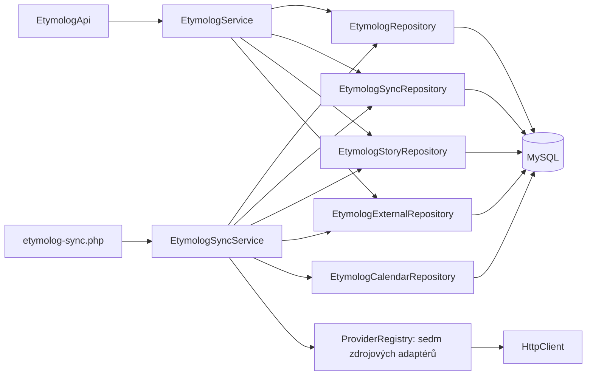

# Etymolog

Tenantová redakční databáze křestních jmen, příjmení, jejich výkladů a historických
podkladů. API je pod `/api/etymolog`. Všechny endpointy vyžadují stávající
`X-Internal-Key` a Bearer token ze společného `/api/auth/login`.
`Host` / důvěryhodný `X-Forwarded-Host` se vyhodnocuje běžným `Request::resolveCode()`.
Interní klíč patří pouze do serverového proxy; nikdy do prohlížeče.

## Architektura

- `ResourceRegistry`: pevná mapa doménových zdrojů, polí, typů a vztahů.
- `EtymologRepository extends BaseRepository`: výhradní CRUD SQL, filtry,
  projekce, tenantové vazby a transakce. Sdílená implementace obsluhuje pouze
  deset pevně deklarovaných tabulek, nikoli libovolné názvy z HTTP.
- `EtymologService`: autentizace, validace, orchestrace jednotlivých repository,
  kontrola citací, redakční pravidla.
- `EtymologApi`: routy a standardní `Response` obálka; nepracuje s DB.
- `EtymologSyncRepository`: SQL pro importovaná jména, plánování a historii běhů.
- `EtymologStoryRepository`: SQL pro importované pověsti, zdroje, citace a návrhy vazeb.
- `EtymologExternalRepository`: SQL pro etymologie, statistiky a licencované zdrojové snapshoty.
- `EtymologCalendarRepository`: SQL importu kalendáře a historických výročních dat.
- `EtymologSyncService`: jedna atomická dávka, kurzor, evidence chyby a další termín.
- `Contracts/BatchProvider` (pro jména `NameProvider`), `ProviderRegistry`,
  providery Wikidata, Wikisource, Wiktionary, PESEL a ČSÚ:
  adaptéry zdrojů. HTTP výhradně přes injektovaný `HttpClient`, vytvořený pomocí
  `HttpModule::client()` v CLI composition root. URL třetích stran uložené jako
  citace se nikdy automaticky nestahují.



## Instalace

Na existující databázi spustit jen aditivní SQL v tomto pořadí (lze i v Admineru):

1. `migrations/2026-09-27-etymolog.sql` – devět tabulek, opakovatelné `CREATE TABLE IF NOT EXISTS`.
2. `migrations/2026-09-27-etymolog-tenant.sql` – volitelný seed pro tenant `etymolog`:
   standardní role `user`/`admin` a dvě české synchronizační úlohy.
3. `migrations/2026-09-28-etymolog-stories.sql` – dvě další tabulky a nullable
   `entries.name_id`; existující primární vazby zůstávají zachované.
4. `migrations/2026-09-28-etymolog-stories-tenant.sql` – volitelná úloha
   `wikisource/cs/stories`, až čtyři kapitoly denně.
5. `migrations/2026-09-28-etymolog-sources.sql` – externí etymologie/statistiky,
   delší neprůhledný kurzor, importní identita zdroje a datum/populace výskytu.
6. `migrations/2026-09-28-etymolog-sources-tenant.sql` – volitelné nové úlohy.
7. `migrations/2026-09-28-etymolog-culture.sql` – webový původ textů, kalendáře a dny.
8. `migrations/2026-09-28-etymolog-culture-tenant.sql` – Erben a český jmenný kalendář.

Celkem má modul 14 tabulek. Rozšiřující migraci aplikovat před použitím nového
API. Vyžaduje PHP DOM (v tomto projektu již požadované závislostí dompdf);
ČSÚ XLSX import navíc vyžaduje PHP zip.

Předpokládá se již existující core schéma pro auth. `migrations/schema.sql` je
určeno jen pro prázdnou databázi a nesmí se spouštět na existující instalaci.
Seed neupravuje již existující role ani úlohy, neobnovuje smazané záznamy,
nevytváří uživatelské účty, hesla nebo tokeny. Běžná registrace pak používá
existující `/api/auth/register`; první administrátor se provisionuje postupem
projektu přes existující správu uživatelů/rolí. Není zaveden paralelní auth modul.

Do `FRANCHISE_CODES` přidat `etymolog.localhost:etymolog` pro lokální frontend.
Produkční doménu přidat až podle skutečného hostingu. `.env.example` obsahuje
lokální mapování. `ETYMOLOG_WIKIDATA_USER_AGENT` umožňuje doplnit veřejný kontakt
provozovatele; nepřidávat do něj klíče ani jiné přihlašovací údaje.

## Tabulky a CRUD

Všechny doménové tabulky mají `id`, `franchise_code`, `created_at`, `updated_at`,
`deleted`, `created_by`, `updated_by`. Identita autora se bere z Bearer tokenu.
Tenant a systémové sloupce nelze změnit requestem. Vztahy ověřuje service a
navíc složené FK `(franchise_code, id)` v MySQL.

| API resource | Tabulka | Povinné při POST / PUT | Další pole |
|---|---|---|---|
| `names` | `etymolog_name` | `name`, `kind` | `language`, `country_code`, `summary`, `published` |
| `sources` | `etymolog_source` | `title` | `author`, `url`, `license`, `license_url`, `attribution`, `notes` |
| `entries` | `etymolog_entry` | `type`, `title`, `body` | `name_id`, `certainty`, `language`, `region`, `year_from`, `year_to`, `published`, `source_url` (povinné u kulturního textu) |
| `entry-names` | `etymolog_entry_name` | `entry_id`, `name_id` | `relation`, `reviewed`, `notes` |
| `variants` | `etymolog_variant` | `name_id`, `variant` | `target_name_id`, `relation`, `language`, `region`, `year_from`, `year_to`, `source_id`, `notes` |
| `occurrences` | `etymolog_occurrence` | `name_id`, `source_id`, `country_code`, `observed_year` | `region`, `count`, `observed_on`, `sex`, `measure`, `original_spelling`, `locator`, `notes` |
| `citations` | `etymolog_citation` | `entry_id`, `source_id` | `url`, `locator`, `quotation`, `notes` |
| `calendars` | `etymolog_calendar` | `title`, `country_code`, `system`, `tradition` | `region`, `year_from`, `year_to`, `notes` |
| `calendar-days` | `etymolog_calendar_day` | `calendar_id`, `source_id`, `title`, `source_url` | `name_id`, `entry_id`, `kind`, `date_kind`, `month`, `day`, `date_rule`, `locator`, `notes`, `published` |
| `sync-jobs` | `etymolog_sync_job` | `title` | `provider`, `language`, `kind`, `batch_size`, `interval_seconds`, `enabled` |

Pro každý resource:

- `GET /{resource}` – seznam, `page`, `limit` (1–100), `q`, `sort`, `projection`.
- `GET /{resource}/{id}` – detail, volitelná `projection`.
- `POST /{resource}` – vytvoření, HTTP 201.
- `PATCH /{resource}/{id}` – mění jen dodaná pole; explicitní `null` maže nullable hodnotu.
- `PUT /{resource}/{id}` – nahrazení všech editovatelných polí; vynechaná volitelná pole se resetují.
- `DELETE /{resource}/{id}` – soft delete.
- `DELETE /{resource}/{id}?force=true` – admin, fyzické smazání i již archivovaného záznamu.

Běžný přihlášený uživatel může spravovat veškerý redakční obsah svého tenantu.
`sync-jobs` a historie synchronizací vyžadují roli `admin`. Fyzické mazání
vyžaduje `admin` u všech zdrojů. Nové záznamy jmen a výkladů jsou drafty
(`published=0`). Veřejné čtení zatím není vystavené ani pro publikované záznamy.

API odmítá neznámá pole, neplatné enumy, reference mimo tenant a reference na
smazané záznamy. `422` je validace, `404` neexistující/cizí záznam, `409` závislosti
nebo souběžná změna. Soft delete rodiče vyžaduje nejprve odstranění jeho aktivních
závislostí; hard delete blokují i archivované závislosti a systémové importy/běhy.

`names.kind`: `given`, `surname`. `sync-jobs.kind` dále umožňuje `stories`, `surname_male`, `surname_female`, `births_2025`, `folklore`, `calendar` podle provideru.
`entries.type`: `etymology`, `history`, `clerical_error`, `legend`, `mythology`, `fiction`, `tradition`, `proverb`.
`certainty`: `documented`, `hypothesis`, `unverified`, `fiction`.
`variants.relation`: `spelling`, `historical`, `transliteration`, `feminine`, `related`.

Fikce musí mít současně `type=fiction` a `certainty=fiction`. Publikovaný
`documented` výklad musí mít aktivní citaci. Tu nelze přesunout ani smazat,
dokud se výklad neodpublikuje. Publikovaná tvrzení o úřední chybě musí být
`documented` a citovaná. Přítomnost citace je redakční podmínka, automaticky
neověřuje pravdivost tvrzení.

Region a období patří ke konkrétnímu výkladu či dokladu. `observed_year` je rok
statistiky nebo historického dokladu, nikoli automaticky rok vzniku jména.
`country_code` je dvoupísmenný kód a `language` jazykový kód; jsou nezávislé.

Příklad vytvoření hesla:

```http
POST /api/etymolog/names
Authorization: Bearer <token>
Content-Type: application/json

{"name":"Novák","kind":"surname","language":"cs","country_code":"CZ"}
```

Filtr pro vyhledávání jména (hodnotu `q` URL-enkódovat):

```json
{"name":{"value":"novak","operator":"regex"},"kind":"surname"}
```

Používá se projektový formát `q`, `SQL_FILTER`, `SQL_SORT`, `Projection` a
whitelist sloupců. Pole `name` a `variant` používají pro vyhledávání
`utf8mb4_unicode_ci`; původní zápis se uchovává. Pro detail hesla získat jeho
výklady, varianty a výskyty filtrem `{"name_id":123}` na příslušném resource,
citace filtrem `{"entry_id":456}`. Sdílené příběhy hledat také přes
`entry-names?q={"name_id":123,"reviewed":1}` a navázaná `entry_id`; samotný
filtr `entries.name_id` sdílené příběhy bez primárního jména nevrací. Nejsou zavedeny paralelní číselníky zemí/regionů.

## Synchronizace a licence

První provider používá pouze strukturovaná data Wikidat pod **CC0-1.0**.
Nescrapuje cizí články, slovníky, rozhlas ani text Wikipedie. Zdroje:

- [Wikidata licence](https://www.wikidata.org/wiki/Wikidata:Licensing)
- [Wikidata přístup k datům](https://www.wikidata.org/wiki/Wikidata:Data_access)
- [WikibaseCirrusSearch](https://www.mediawiki.org/wiki/Help:Extension:WikibaseCirrusSearch)
- [MediaWiki Search API](https://www.mediawiki.org/wiki/API:Search)

Discovery používá `action=query&list=search`, konkrétní `P31` a `P407` a řazení
podle vytvoření. Následuje dávkové `wbgetentities`. Pro příjmení se v první verzi
načítá třída `Q101352`, pro křestní jména `Q202444`, `Q12308941`, `Q11879590`,
`Q3409032`. Nejde o kompletní pokrytí všech podtříd nebo všech jmen v zemi.

`language` u úlohy filtruje explicitní jazykové užití podle `P407`, nikoli
národnost či zemi původu. Podporuje `cs`, `sk`, `pl`, `uk`, `de`, `en`. Aktuální
záznam se před importem znovu kontroluje podle `P31` a `P407`; zastaralý výsledek
vyhledávacího indexu se přeskočí. Popisek preferuje vybraný jazyk, potom `mul`
a `en`. Země původu zůstává nevyplněná.

Jedna úloha zpracuje 1–50 výsledků na běh (výchozí 20), interval 300–2592000 s
(výchozí 3600). Jedno spuštění CLI zpracuje jednu nejstarší splatnou úlohu.
Ukončený průchod resetuje kurzor, takže další průchod aktualizuje starší záznamy.
Kurzor je neprůhledný systémový řetězec, v aktuálním provideru offset vyhledávání.
Index není neměnný snapshot; opakované průchody kompenzují posuny výsledků.

Vyhledávací okno má limit 10000 výsledků. Jeho dosažení hlásí
`search_window_exceeded`, nikdy předstírané dokončení; pro větší korpus je potřeba
přidat dělení dotazů nebo dump provider. První české úlohy jsou zamýšlené jako
počáteční obsahový základ. Změna `provider`, `kind` nebo `language` úlohy resetuje kurzor.

Systémové tabulky:

- `etymolog_import_record`: poslední snapshot strukturovaného záznamu včetně
  `labels`, `descriptions`, `aliases`, `claims` (s referencemi a kvalifikátory),
  `external_id`, `source_url`, `revision`, licence, atribuce, hash a čas získání.
- `etymolog_sync_run`: audit stavu běhu, počet zpracovaných položek, bezpečný
  chybový kód a začátek/konec v UTC. `processed` počítá validní položky dávky,
  nikoli počet nově vytvořených jmen.

Tyto záznamy spravuje synchronizace; nejsou to ručně editovatelná fakta. Čtení:

- `GET /names/{id}/imports` – podklady konkrétního hesla, přihlášený uživatel.
- `GET /sync-jobs/{id}/runs?page=1&limit=20` – historie úlohy, admin.

Importované heslo má stabilní `import_key=wikidata:{kind}:{QID}`. Při prvním
importu vznikne draft; opakování mění pouze zdrojový snapshot. **Cron nepřepisuje
ruční název, jazyk, shrnutí, výklad ani publikaci.** Ručně vytvořená stejně znějící
hesla se automaticky neslučují. Soft-smazané importy se neobnovují.

Importované popisky ani popisy nejsou vydávány za etymologický výklad. Výklady a
příběhy vznikají přes redakční CRUD; odkazy ze snapshotů slouží jako podklady.
Zdrojové smazání nebo změna klasifikace automaticky nemaže redakční obsah;
stáří snapshotu zůstává viditelné v `fetched_at`.

Dávka i kurzor se zapisují v jedné transakci. Při chybě zůstanou předchozí data a
kurzor zachované, chyba a nový termín se zapíší zvlášť. HTTP timeout, limit těla,
`maxlag`, HTTP 429 a `Retry-After` jsou ošetřené. Přesměrování nejsou povolené.
Jeden tenantový MySQL advisory lock brání souběžnému cronu i konfliktům s CRUD;
při delší HTTP dávce mohou zápisy do stejného tenantu dostat `409` a mají se
opakovat. Čtení a ostatní tenanty běží nezávisle. Přerušený běh se při dalším
spuštění označí `interrupted`. Do DB/logů se neukládá upstream chybové tělo.

## CLI a cron

```bash
php scripts/etymolog-sync.php --tenant=etymolog
php scripts/etymolog-sync.php --tenant=etymolog --job=123
```

Tenant musí existovat v `FRANCHISE_CODES`; i `--job` respektuje tenant, enabled
a splatnost. Výstup je JSON se stavem `idle`, `success`, `complete`; selhání má
exit code 1, chybný CLI vstup 2. Skript je dostupný pouze z CLI.

Příklad budoucího cronu (absolutní cesty přizpůsobit serveru):

```cron
*/5 * * * * cd /srv/php-core && /usr/bin/php scripts/etymolog-sync.php --tenant=etymolog >> /var/log/etymolog-sync.log 2>&1
```

Samotná instalace modulu nemění systémový crontab. Seed připraví české úlohy;
admin může další úlohy přidávat přes CRUD. Wikisource úloha má vlastní denní
interval a aktuálně podporuje pouze český kurátorovaný katalog. Výchozí hodinový interval každé úlohy
se respektuje i při pětiminutovém spouštění skriptu.

## Ověření

```bash
bash scripts/test-etymolog.sh
bash scripts/test-http.sh
bash scripts/test-transport.sh
```

Etymolog test spouští samostatný MySQL na dočasném unix socketu se zakázanou sítí,
reálné HTTP API a existující `/auth/login`. Nikdy netestuje na aplikační DB.
Ověřuje opakovatelnost migrací, všechny CRUD zdroje, dva tenanty, běžného uživatele
vs. admina, projekce, validaci, ochranu citací, FK, idempotenci, souběh a rollback
importu. Externí odpovědi jsou v integračních testech deterministické fixtures;
živý smoke test provideru je samostatné ověření dostupnosti zdroje.


## Pověsti, mytologie a sdílené příběhy

`legend` označuje tradovanou pověst, `mythology` mytologické vyprávění a `fiction`
převzatý literární smyšlený příběh (vyžaduje i `certainty=fiction`). Nejde o automatický důkaz
původu jména. `certainty` se týká tvrzení v textu; samotná citace dokládající
existenci pověsti není důvodem označit její děj jako historicky doložený.

Existující `entries.name_id` zůstává kompatibilním primárním odkazem. Nově může
být `null`; jeden text se přes `etymolog_entry_name` propojí s více hesly bez
kopírování obsahu. Vazba má `relation=mentioned|story_subject|name_origin` a
`reviewed=0|1`. Import navrhuje pouze `mentioned, reviewed=0`. Potvrzení vazby
znamená redakční kontrolu souvislosti, nikoli ověření pravdivosti pověsti.

`entry-names` má stejné CRUD a tenantové FK jako ostatní redakční zdroje.
Duplicitní aktivní dvojici `entry_id + name_id` odmítá service pod tenantovým
zámkem (409). Odmítnutý návrh se soft-smaže. Opakovaný import jej neobnovuje.
Pro prezentaci schválených souvislostí musí klient filtrovat `reviewed=1`;
publikace textu a potvrzení vazeb jsou dvě nezávislé redakční operace.

Příklad schválení souvislosti:

```http
PATCH /api/etymolog/entry-names/123
Authorization: Bearer <token>
Content-Type: application/json

{"reviewed":1,"relation":"story_subject"}
```

Nový provider `wikisource` má pevný, pouze rozšiřovaný katalog čtyř kapitol
z Jiráskových Starých pověstí českých (vydání 1959):

- O Libuši – návrhy Libuše, Kazi, Teta.
- O Přemyslovi – Přemysl, Libuše.
- O Bivoji – Bivoj, Kazi, Libuše.
- O Krokovi a jeho dcerách – Krok, Kazi, Teta, Libuše.

Volá jen `https://cs.wikisource.org/w/api.php` (`action=parse`), bez přesměrování,
s timeoutem, limitem velikosti, ošetřením `maxlag` a `Retry-After`. Žádné URL
z redakčního obsahu nestahuje. Před každým importem ověří titul, autora a přesné
licenční označení `PD old 70` v metadatech kapitoly. Jiné licence, změna struktury
nebo chybějící údaje zastaví dávku bez posunu kurzoru. Licence se ukládá jako
`PD-old-70` s odkazem na konkrétní označení Wikizdrojů, nikoli jako CC0.

Z API HTML vybírá pouze odstavce prózy; odstraní navigaci, metadata, skripty a
obrázky. Ukládá **prostý text** s odstavci, bez obrázků a typografických ozdob.
Frontend jej musí zobrazovat jako text, nikoli jako důvěryhodné HTML.
[Dokumentace MediaWiki Parse API](https://www.mediawiki.org/wiki/API:Parsing_wikitext).

Při prvním importu vzniká draft `legend/unverified`, zdroj s bibliografií,
citace s trvalým odkazem na revizi a návrhy vazeb na jména. Existující jméno se
použije jen při jednoznačné shodě přesného zápisu, jazyka `cs` a druhu `given`.
Chybějící jméno vznikne jako draft; neobsahuje tvrzení o původu či současném
užívání. Při více shodách nebo archivovaném heslu zůstane návrh jen ve snapshotu
pro ruční přiřazení. Stabilní importní klíč zachová i ručně přejmenovaná hesla.

`etymolog_story_import` uchovává poslední snapshot a odkazuje tenantovými FK
na `entry` i `source`. Unikátní `(franchise_code,provider,external_id)` brání
duplikátům. Obsahuje revizi, licenci, autora/atribuci, původní extrahovaný text,
navrhovaná jména, bibliografii, hash a čas načtení. Nejde o historii všech revizí.
Čtení přes `GET /entries/{id}/imports` vyžaduje přihlášení a aktivní heslo výkladu.

Další průchod mění **pouze snapshot**. Nepřepisuje text, citaci, zdroj, publikaci
ani schválené/odmítnuté vazby. Novou revizi může redaktor zkontrolovat a přenést
přes běžný PATCH; stará citace nadále správně ukazuje na původní převzatou revizi.
Archivované příběhy se neobnovují. Hard delete příběhu/zdroje blokuje snapshot;
soft delete nadále respektuje aktivní doménové závislosti.

Příklad úlohy (admin):

```json
{"title":"České pověsti","provider":"wikisource","kind":"stories","language":"cs","batch_size":1,"interval_seconds":86400,"enabled":1}
```

Wikisource připouští dávku 1–4 kapitol; `language=cs, kind=stories` jsou povinnou
kombinací. Obecný CLI skript `scripts/etymolog-sync.php --tenant=etymolog --job=ID`
zpracuje splatnou úlohu stejným způsobem jako Wikidata. Po poslední kapitole
resetuje kurzor. Synchronizace pracuje s celou dávkou v jedné transakci včetně
nových jmen, zdrojů, citací a vazeb. Cizojazyčné sbírky ani generování AI příběhů
nejsou součástí tohoto provideru. Generování vlastních příběhů AI je zakázané;
CRUD slouží k evidenci skutečně převzatých webových textů.


## Další zdroje: Wiktionary, PESEL a ČSÚ

Podrobný průzkum, licence, limity a zdroje vyžadující další dohodu:
[Prameny Etymologu](../../../docs/etymolog-sources.md).

| Provider | language | kind | batch_size | Výstup |
|---|---|---|---|---|
| wikidata | cs/sk/pl/uk/de/en | given/surname | 1–50 | katalog jmen |
| wikisource | cs | stories | 1–4 | pověsti a návrhy vazeb |
| wiktionary | cs/sk/pl/uk/de/en | given/surname | 1–3 | etymologický draft v angličtině |
| poland-pesel | pl | surname_male/surname_female | 1–500 | příjmení žijících osob k datu |
| csu-baby-names | cs | births_2025 | 1–500 | TOP 100 novorozeneckých jmen 2025 |
| erben-folklore | cs | folklore | 1–4 | pranostiky a tradice z Erbena |
| czech-namedays | cs | calendar | 1–500 | konkrétní český komunitní kalendář |

`EtymologExternalRepository` zajišťuje SQL pro nové importy. `etymolog_external_record`
má unikátní `(franchise_code,provider,external_id)`, tenantové FK na jméno, zdroj
a výklad nebo výskyt, revizi, hash, licenci, atribuci a poslední zdrojový JSON.
Zdroj má interní `import_key` (read-only); statistické řádky sdílejí jeden zdroj
za vydání. Snímky nejsou ručně editovatelné, redakční entity mají běžný CRUD.

Nové čtecí endpointy (stávající auth + internal key):

- `GET /names/{id}/external-records` – nové zdrojové podklady konkrétního jména.
- `GET /entries/{id}/imports` – vrací podklady pověstí i etymologie Wiktionary.
- `GET /occurrences/{id}/imports` – zdrojový statistický řádek.
- `POST /sync-jobs/{id}/reset` – admin; reset kurzoru a splatnosti, zachová
  importovaná data a audit. Použít po kontrole změněného CSV/XLSX snapshotu.

`observed_on` je nullable datum YYYY-MM-DD; pokud je vyplněno, musí odpovídat
`observed_year`. `sex=male|female|all`, `measure=living_persons|births|historical_attestation`
jsou nullable pro kompatibilitu starších údajů. Roční statistika narození má
pouze rok, nikoli uměle doplněné datum. Import celostátní statistiky neodvozuje
jazyk či národnost. Původní velká písmena jmen se zachovávají; neslučují se
automaticky s podobně znějícími jmény jiného zápisu nebo jazykového zařazení.
Při nejednoznačné přesné shodě import ohlásí `ambiguous_name_match`; redaktor
musí vyřešit duplicitu, pak administrátor obnoví průchod.

Etymologie jsou koncepty `unverified` se zdrojem a citací. Při opakovaném importu
se mění pouze snapshot: nepřepisují se ruční texty, statistické hodnoty,
zdroje ani citace. Pokud poskytovatel opraví číslo ve stejném vydání, je nové
číslo ve snapshotu; redaktor jej přenese přes PATCH. Nové roční vydání PESEL má
vlastní výskyty. ČSÚ je nyní výslovně omezeno na ověřené vydání 2025.

Kurzor je interní JSON/řetězec do 2048 znaků. Po resetu nebo dokončení se data
znovu procházejí idempotentně. Ve výstupu CLI `scanned` u Wiktionary uvádí počet
prohlédnutých hesel, `processed` jen počet nalezených výkladů; nula neznamená
chybu, pokud hesla neměla samostatný vhodný etymologický oddíl.

XLSX provider potřebuje rozšíření PHP **zip** a **dom**. Veškeré síťové požadavky
vedou přes sdílený HTTP modul. Cron zůstává stejný; `--job=ID` umožňuje spustit
konkrétní splatnou úlohu. Při 429 úloha zaznamená backoff; neresetovat ji jen
kvůli vynucení dalších požadavků. Dlouhá importní dávka může držet tenantový
zámek déle; souběžný CRUD vrátí 409 a má se opakovat.


## Kulturní texty: vždy z konkrétního webového pramene

Pro `legend`, `mythology`, `fiction`, `tradition` (tradice, zvyky, říkadla) a
`proverb` (pranostiky) je **již při vytvoření konceptu povinné `source_url`**.
Fikce znamená existující literární dílo převzaté z webu, nikoli nový AI příběh.
Žádný zdejší provider nepoužívá AI, nepřepisuje vyprávění a nevymýšlí chybějící
jména, tradice ani datum. Originální znění se ukládá také do citace `quotation`
(limit nově 60000 bajtů, stejný jako text výkladu).

Publikace kulturního textu vyžaduje aktivní citaci stejné webové URL, pramen
s licencí a autorem/atribucí a text shodný s citovaným originálem nebo jeho
souvislým doslovným výňatkem. Porovnání normalizuje jen bílé znaky. Vyměnit
citaci nebo měnit její pramen lze až po odpublikování. Také úprava těla již
publikovaného textu znovu podléhá této kontrole. Převyprávění či překlad nejsou
v tomto režimu doslovným převzetím a kontrolou neprojdou.

Ruční koncept může sloužit k rozpracování přepisu; bez odpovídajícího citátu
se nezveřejní. U ručně zadané URL a citátu redaktor ověřuje, že web skutečně
obsahuje daný text a dovoluje převzetí. Backend neprohlašuje libovolnou vloženou
URL za ověřenou a automaticky ji nestahuje. Mechanismus není detektorem AI ani
zárukou pravdivosti tvrzení uživatele; konektory stahují jen povolené prameny.
Existence webové citace sama nečiní mýtus historickou skutečností.

Migrace doplní starším importům webovou URL ze snapshotu a původní citát pouze
při shodě citované URL se snapshotem. Nikdy nevydává redaktorem upravené tělo
za původní text. Již vyplněný citát a obsah výkladu nemění.

`erben-folklore`, `language=cs`, `kind=folklore`, dávka 1–4: čtyři kurátorované
kapitoly **Prostonárodní české písně a říkadla (1864)**. Provider při každém
načtení kontroluje autora, titul, bibliografii a PD old 70. Uchovává verše,
odstavce, dobové znění i místní poznámky, odstraní navigaci a HTML. Vazby na
jména jsou návrhy `reviewed=0`; např. Kučera je příjmení, nikoli křestní jméno.
Kapitoly 25. ledna, 24. února a 12. března mají datum v historickém kalendáři;
kapitole Na jmena se datum nevymýšlí.

## Kalendáře a kalendářní dny

Nové plné CRUD zdroje (stejné přihlášení, tenant a audit):

- `/api/etymolog/calendars`: název, země, `system=gregorian|julian`, tradice,
  region, volitelný rozsah let a poznámka. Jde o konkrétní kalendářní edici.
- `/api/etymolog/calendar-days`: kalendář, zdroj, webová URL, název, typ dne,
  případné jméno a výklad, datum a poznámka. `kind=name_day|feast|observance|folklore`.
- `GET /api/etymolog/calendar-days/{id}/imports`: poslední externí podklad
  jmenného kalendáře. U historického data Erbena je podklad na připojeném
  výkladu: `/entries/{entry_id}/imports`.

Vazby jsou tenantové FK. Jeden kalendář má více dnů, jeden den může mít více
záznamů/jmen a jedno jméno může mít více dat i různých kalendářů. Výroční
pranostika odkazuje na výklad, jeho citaci a přes `entry-names` na jména;
nelze tím automaticky odvodit současné jmeniny všech osob zmíněných v textu.

Pevné opakované datum: `date_kind=fixed`, `month`, `day`, `date_rule=null`.
29. únor je povolen, 31. duben nikoli; v nepřestupném roce se datum samo
nepřesouvá. Pohyblivý svátek: `date_kind=movable`, `month=day=null`, povinné
textové `date_rule` převzaté z pramene. Pravidlo se v této verzi **nevyhodnocuje**
na konkrétní rok; julian/gregorian se automaticky nepřevádí. Ročníky kalendáře
ani historický den se nezaměňují za datum v dnešním občanském kalendáři.

`name_day` vyžaduje křestní jméno; státní a jiné významné dny mají `name_id=null`.
`folklore` vyžaduje `entry_id`. Zobrazení se řídí vlastním `published` (výchozí 0).
Před publikací dne musí mít pramen licenci a atribuci/autora. Úpravu pramene
publikovaného dne je nutné provést až po odpublikování závislých dnů.
Běžné `q` umožňuje filtrovat např. `{"calendar_id":1,"month":2,"day":24}`
nebo `{"name_id":123,"kind":"name_day"}`.

`czech-namedays`, `language=cs`, `kind=calendar`, dávka 1–500: komunitní český
kalendář z repozitáře **segeda/svatky-api-nodejs**, Unlicense. Nový průchod
zjistí commit hlavní větve; pokračování drží tento commit. Licence se kontroluje
přes otisk ověřeného znění. Ze souboru `cs.js` se přečte jen JSON objekt,
JavaScript se nikdy nespouští. Kontroluje se všech 366 platných dat a oddělují
se jmeniny od konkrétně ověřených významných dnů. Neznámý víceslovný popisek
vyžaduje kontrolu, nestane se automaticky jménem. Nejde o oficiální liturgický
ani právní kalendář a neobsahuje všechny možné varianty jmenin.

Obě synchronizace vytvářejí koncepty, opakování aktualizuje jen snapshot;
ruční úpravy a archivované záznamy zachovává. Zmizí-li položka v nové verzi
zdroje, starý redakční záznam se automaticky nemaže; vyžaduje revizi redaktorem.
